# Laporan praktikum sistem operasi

Nama : Mohamad Ahmad Gofar

NIM : 254107020068

Tanggal : 2/23/2026

# pendahuluan

## Latar Belakang

menjelaskan langkah-langkah instal ubuntu di VisualBox agar mudah di pahami 

## Tujuan praktikum 
1. memahami cara instal ubuntu di VisualBox
2. memenuhi tugas sistem operasi

## 1.10.1 Latihan K onseptual 
### latihan 1.1

1. manajement sumber daya

    windows : mengatur penggunaan cpu dan ram agar berjalan lancar
   
   linux : mengoptimalkan penggunaan memori ram yang efisien, bahkan di server ram rendah
2. antarmuka pengguna
   
   windows : menyediakan GUI melalui file explorer dan start menu untuk mengakses file yang mudah
   
   linux : menyediakan CLI atau teminal yang kuat seperti perintah ls -la untuk melihhat seluruh file
3. manajemen file
   
   windows : mengelola sistem file NTFS untuk menyimpan data, mengatur struktur folder dan hak akses file

    linux : menggunakan sistem file ext4 di mana file di atur dengan struktur direktori hierarkis
4. manajemen proses
   
   windows : memunginkan multi tasking aerta menghentikan aplikasi via manager

   linux : melakukan penjadwalan proses yang efisien menggunakan perintah top atau htop untuk memantau proses
5. manajemen dan kontrol akses

   windows : melindungi sistem dari malware menggunakan windows defenfer dan autentikasi pengguna

   linux : mengatur izin akses file untuk menjaga keamanan sistem

### Latihan 1.2 
1. Gaming
    
   pemenang : windows
    
   alasan windows memiliki dukungan driver kartu grafis terbaik dan kompatibilitas luas  
2. development
    
   pemenang : linux dan macOS
    
   alasan banyak server di dunia berjalan di atas linux sehingga men deploy kode di lingkungan yang mirip sangat menguntungkan
3. server
     
   pemenang : linux
     
   alasan linux bersifat open source, gratis, sangat efisien dalam penggunaan sumber daya
4. creative work
   
   pemenang : macOS dan windows

   alasan macOS adalah standar indrustri kreatif berkat optimasi seperti adobe creative cloud, dll.
5. Enterprise

   pemenang : windows

   alasan dominasi microsoft office dan kemudahan perangkat
      
## 1.10.2 Latihan Praktikal  
### latihan 1.3

1. Bisa download ubuntu lewat goggle chrome seperti pada gambar
 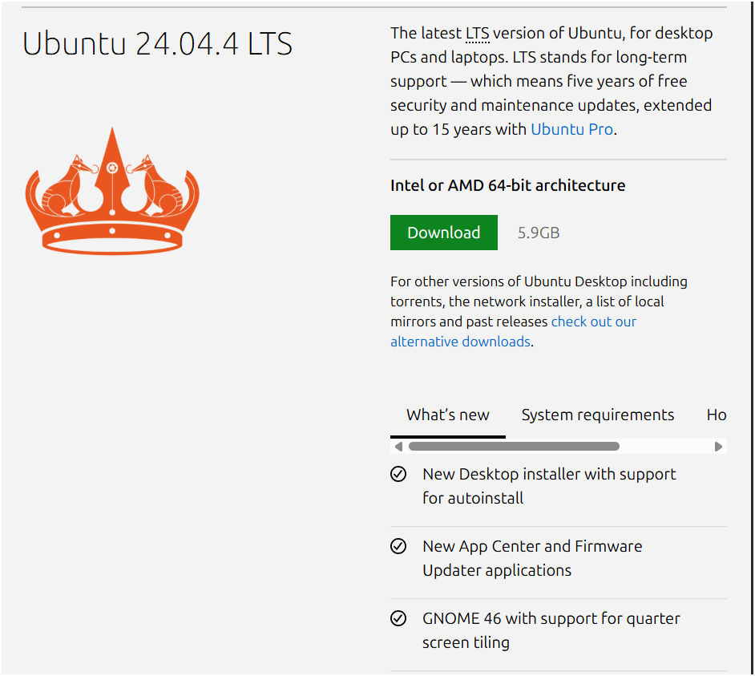

2. kemudian setting Ram : 2GB Disk : 25gb
 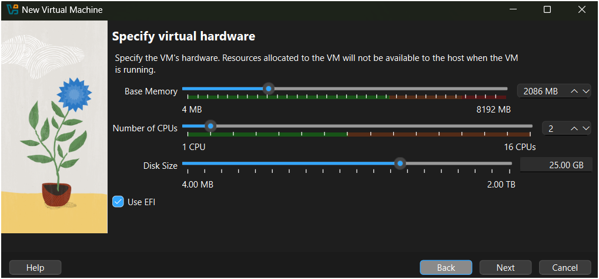

3. install automatic 

4. Buat akun ubuntu nya setelah itu 
 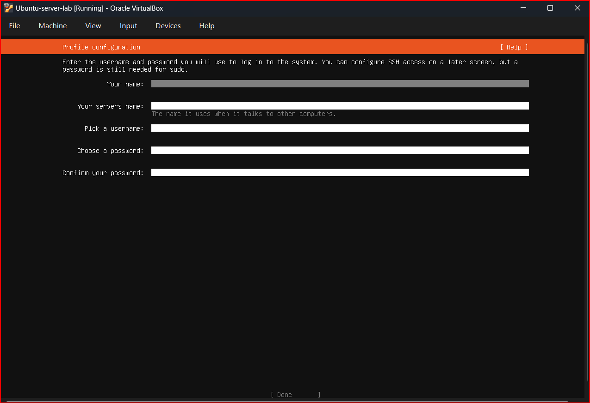

5. setelah proses sebelumnya selesai tunggu 15-20 (menit) jika sudah kemudian reoot dan login ke sistem 
 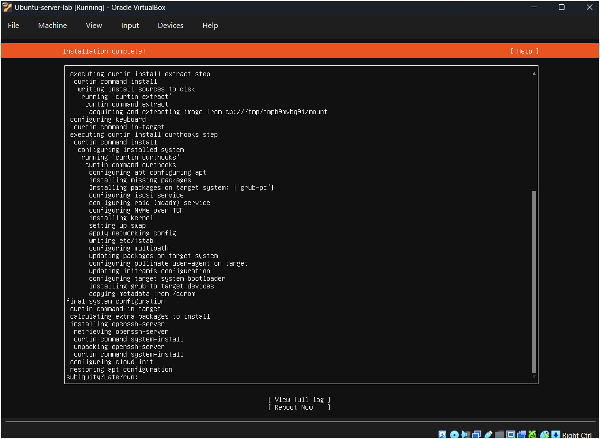

 ### latihan 1.4

 1. kemudian updt package list (sudo apt update)
  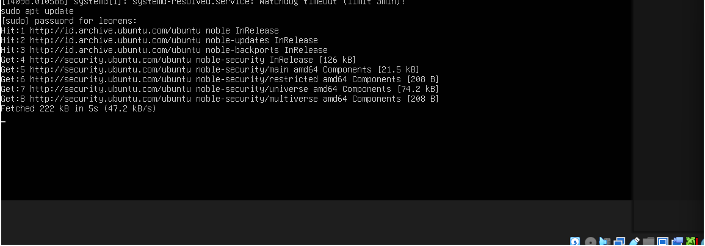
    
 2. setelah itu upgrade package (sudo apt upgrade)
   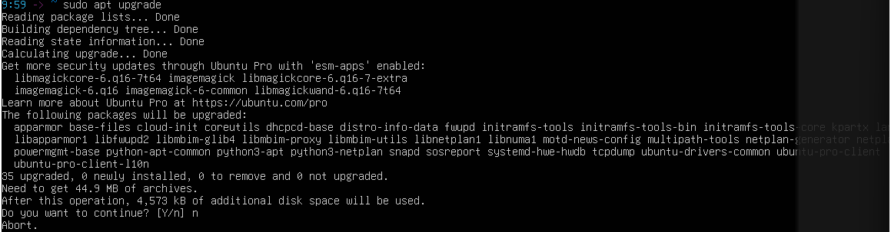

 3. kemudian jalankan (sudo apt install neofetch )

 4. ketik dan jalankan neofetch 
    

 5. check disk dengan df -h 
    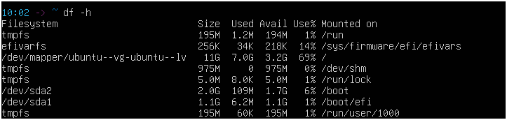
 
 6. check memory dengan free -h
  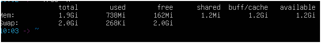

 ### latihan 1.5
 setelah instalasi ubuntu server lalu lakukan 

 1. Tampilkan informasi OS : cat /etc/os-release
  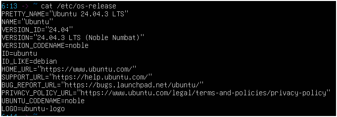

 2. Tampilkan versi kenel : uname -r
  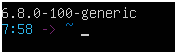

 3. list partisi : lsblk 
  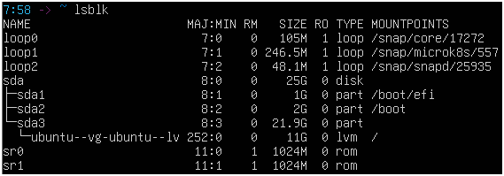
 
 4. check network connectivity : ping -c 4 google.com
   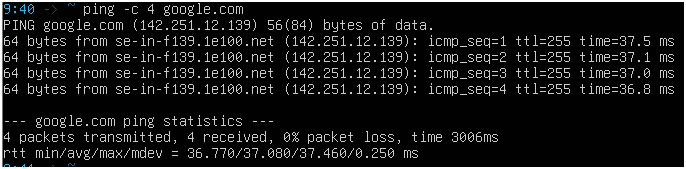

 5. install dan jelaskan (htop) untuk melihhat resource usage
   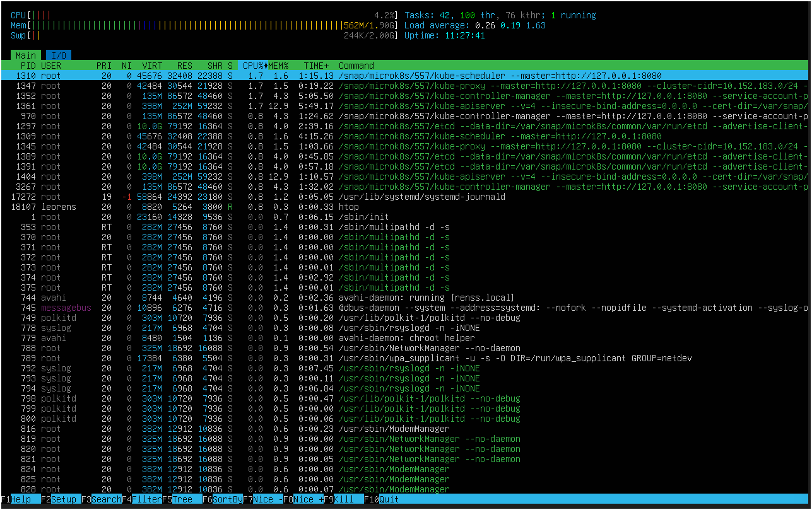 

## 1.10.3. latihan refleksi
### latihan 1.6

 1. sistem operasi yang saya gunakan adalah windows 

 2. selama 6 bulan 

 3. untuk keperluan seperti gaming lebih nyaman dan efisien

 4. banyak update 

 5. baru-baru ini saya menggunakan perangkat lain seperti linux dan saya masih kurang mengerti cara kerja linux

 6. saya ingin untuk mempelajari linux, karena terlihat menarik serta penasaran   

