# laporan praktikum sistem informasi

Nama : Mohamad Ahmad Gofar 
NIM : 254107020068

## praktikum 10.1 melihat penggunaaan memori

1. Jalankan free-h untuk melihat ringkasan RAM dan swap
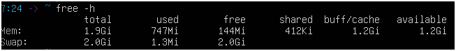

2.  Lihat detail memori dari kernel melalui /proc/meminfo
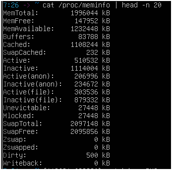
    analisis : 
    1. dari analisi dan penjumlahan di atas hasil dari presentase 61,74%

    2. sudah pernah terpakai dengan jummlah 1.3M

    3. iya sama dengan dijumlahkan

### studi kasus 10.1 server lambat karena memori

1.  Periksa kondisi memori secara keseluruhan

2.  Pantau proses secara real-time

    analisi :

    1. tidak kekurangan masih sekitar 1,18gb

    2. kolom used di swap lebih dari 0 yakni sekitar 0.3

    3. terdapat pada cache/buff dengan 1181.1

## praktikum 10.2 menngamati aktivitas peging

1. Jalankan vmstat dengan interval 1 detik, 5 sampel

    analisis : 

    1. nilai si dan so tetap di 0

    2. tidak ada yang lebih dari 

    3.  masih dalam kondisi 0 tidak naik ataupun turun

    4. tidak rata-rata di 73148 naik sekali saja di bagian kelima di sekitaran 73156 

## praktikum 10.3 membuat dan mengonfigurasi swap file

1.   Buat file berukuran 512 MB sebagai calon swap
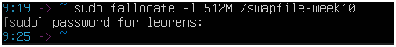

2.  Atur permission file menjadi 600 — hanya root yang boleh membaca
dan menulis

3. format file sebagai area swap lalu aktifkan
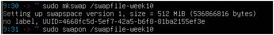

4.  Verifikasi swap aktif. Anda akan melihat entri /swapfile-week10
dengan ukuran 512M, dan nilai total pada baris Swap di free-h bertambah 512M
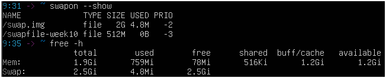

5. Periksa nilai swappiness, ubah sementara, dan verifikasi perubahan
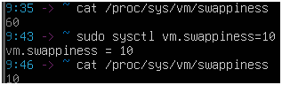

    analisis : 

    1. 60 

    2. dampak swap pada nilai 10 : mengurangi kecendrungan swapping, penigaktan responsivitas

    perbandingan swap pada nilai 60 : keseimbangan sistem lebih agresif dalam membersihkan ram 

    3.  bisa dan sudah muncul 

## praktikum 10.4 monitor memory

1.  Ambil snapshot proses diurutkan dari penggunaan memori terbesar
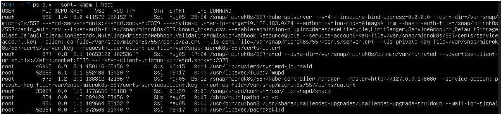

2. Pantau secara real-time dengan top.
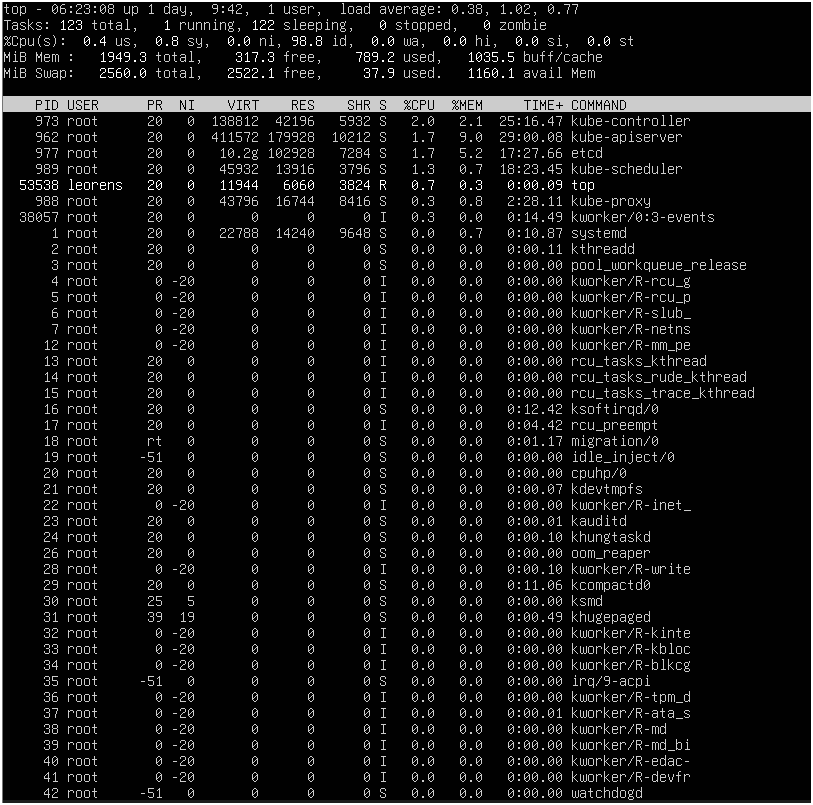

    analisi : 

    1. di urutan pertama ada user: root, PID: 962, mem: 9.3 rss: 10212

    2. 177 mb wajar untuk layanan sistem

    3. itu karena vsz itu adalah jummlah size yanng diminta untuk menjalankan sistem tapi yang rss adalah jumlah real berapa yang terpakai

    4. ps adalah menampilkan saat kita meminta gambaran statis dalam satu titik waktu sedangkan untuk top dia akan memberikan informasi secara real time terkadang dapat memberikann informasi terbaru setiap 3 detik

## praktikum 10.5 script monitor memori 

1. manajemen memori & system call
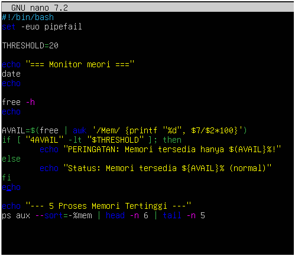

.png)

    analisi : 

    1.    
    
    2.

    3. akan terjadi lonjakan ruang dalam memori sehingga sistem dapat mengalami freezing  
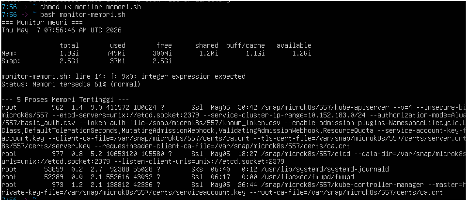

## praktikum10.6 mengamati system call dengan strace

1.  Lihat 30 baris pertama system call dari perintah ls
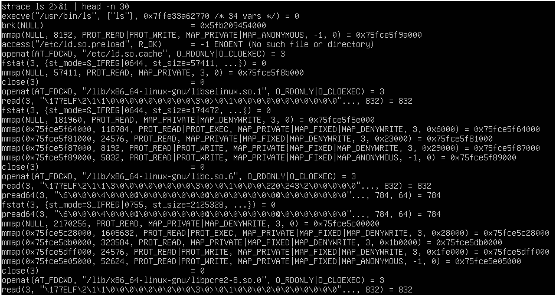

2.  Lihat ringkasan statistik dan bandingkan dua direktori berbeda
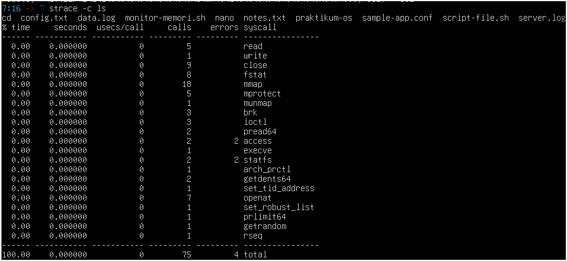
.png)

    analisi : 
    1. execve : di gunakan untuk mengeksekusi program dalam kasus, untuk memanggil ls di dalam shell
        openat : di gunakan untuk membuka file atau direktori

        getdents64 : fungsi untuk membaca struktur dara dari direktoori yang telah di buka openat

        write : di gunakan untuk menulis data ke file descriptor, berfunngsi untuk mencetak daftar nama file ke terminal

    2. yang paling sering di panggil adalah mmap sebanyak 18 kali

    3. jika lebih dari 0 itu kemungkinan ada error 

    4. iya berbeda antara ls dan ls /etc. terkadang di karenakan entitas  yang di baca  

## 1.6 tugas praktikum 

### tugas 10.1 audit penggunaan memori sistem

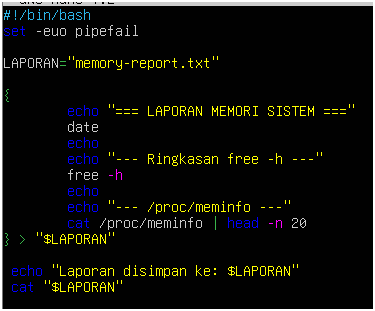

.png)
    
analisis

    1. hasilnya 62,48% tergolong normal

    2. karena biff / cache itu bersifat hanya untuk menampung data sementara  sebelum di taruh di perangkat keras

    3. ya, swaptotal lebih besar dari 0. dan nilai swapfree : 2583112

### tugas 10.2 identifikasi proses dengan memori tertinggi

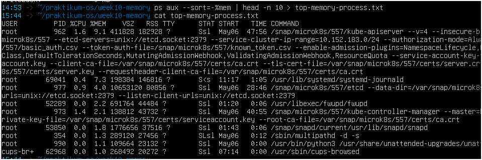

analisis :

    1. mem : 9.1, RSS : 182928

    2.  ya itu aman 

    3. 32,0% 

### tugas 10.3 membuat dan memverifikasi swap file 

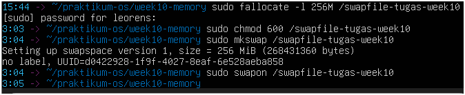

.png)

    analisis : 

    1. NAME                         TYPE        SIZE       USED    
        swap.img                    file        2G         37.4M
        /swapfile-week10            file        512M        0B
        /swapfile-tugas-week10      file        256M        0B

    2. bertambah yang awalnya 2.0Gi jadi 2.0Gi

    3. karena jika di atur ke 644 grub dan other bisa membaca bisa terjadi kebocoran informasi dan jika 600 hanya owner yanng bisa membaca

### tugas 10.4 analisis system call dengan strace

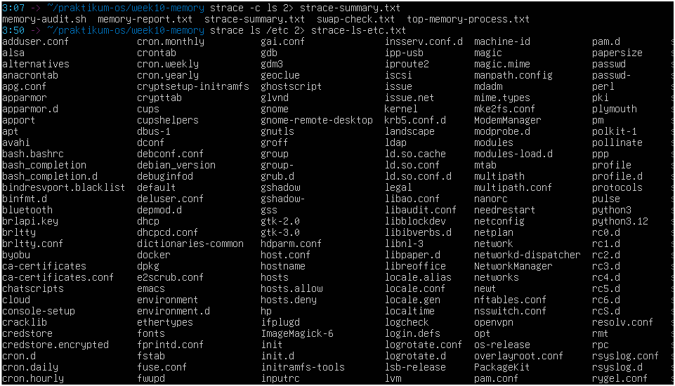
.png)

    analisi : 
    1. adduser.conf : file configurasi untuk perintah adduser. fungsi menentukann pengaturan default 

    alsa : sistem untuk mengelola driver suara, mengkontrol volume 

    alternatives : mengelola beberapa versi program yang berbeda untuk tugas yang sama

    anacrontab : untuk menjalankan tugas-tugas terjadwal (seperti backup atau pembersihan log)

    apg.conf : untuk mengatur parameter dalam pembuatan parameter dalam pembuatan kata sandi

    2. nmap : karena untuk memetakan file atau perangkat ke dalam memori ketika program ls di jalankan

    3. terdapat 2 error di access dan statfs masih tetap bisa berjalan dengan normal

### tugas 10.5 studi kasus diagnosa server lambat 

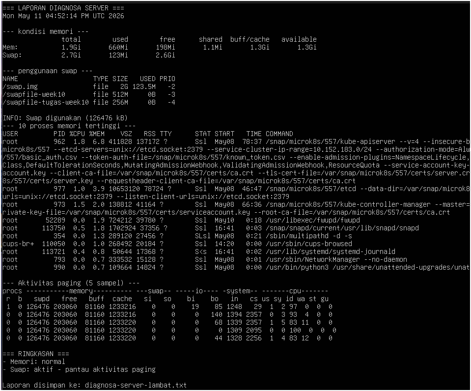

    analisis : 

    1. cek_memori: untuk memantau penggunaan ram dan memastikan pembagian memori yang di gunakan secara jelas
    
        cek_swap: dii gunakan untuk cadangan saat RAM sudah penuh

        cek_proses: mengidentifikasi proses secara spesifik yang memakan cpu atau memori paling banyak

        cek_paging: memantau perpindahan antara ram dan swap

        ringkasan: sebagai panel kontrol dan menggabungkan data-ddata krusial 

    2. kondisi sistem normal, aplikasi utama mendapat ruang di saat menjalankan sistem tanpa berebut secara ekstrem

    nilai ram : masih normal 

    nilai swap : sudah aktif

    nilai paging : sedang diamati jika pada perintah vmstat tinggi status akan berubah menjadi kritis

    3. karena umumnya memakai tee untuk pembuatan script otomatis server di karenakan kepraktisan dan visibilitas

    sedangkan operator redirection > tidak akan menmpilkan seluruh output ke layar terminal dan kita tidak tau script berjalan atau macet

    4. tidak ada aktifitas si dan so bernilai 0
    
