# laporan jobsheet 11 manajemen user & group

Nama : Mohamad Ahmad Gofar 
NIM : 254107020068

## praktikum 9.1 - permission

1. membaca permission, mengubahnya dengan aman, dan memahami efek chmod, chown, serta umask
pada file nyata
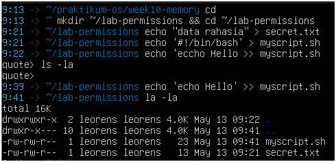

2. membaca permission, mengubahnya dengan aman, dan memahami efek chmod, chown, serta umask
pada file nyata
![LP2_praktikum9.1]

3. Jadikan myscript.sh dapat dijalankan
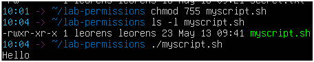

4.  Buat direktori bersama dan amati efek SGID sederhana.
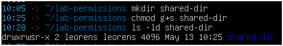

5.  Uji efek umask pada file baru.
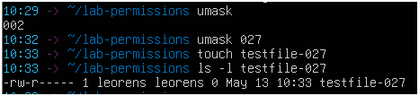

## prakitkum 9.2 - ACL

1. siapkan file dan lihat permission standar tanpa ACL tambahan
[LP1_praktikum9.2](image/LP1_praktikum9.2.png)

2.  Beri akses baca ke satu user tertentu tanpa mengubah owner atau group
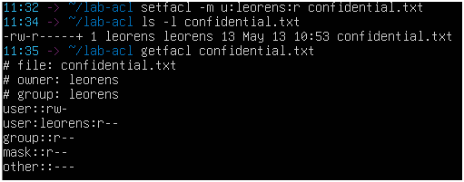

3.  Buat direktori bersama yang mewariskan ACL ke file baru
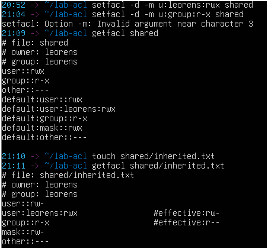

## praktikum 9.3A - membuat dan mengelola user

1. membuat user baru, memodifikasi propertinya, dan memahami perbedaan opsi useradd dan usermod.
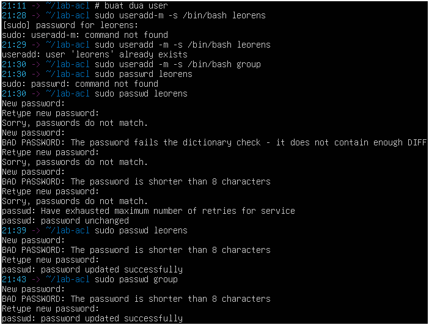
.png)

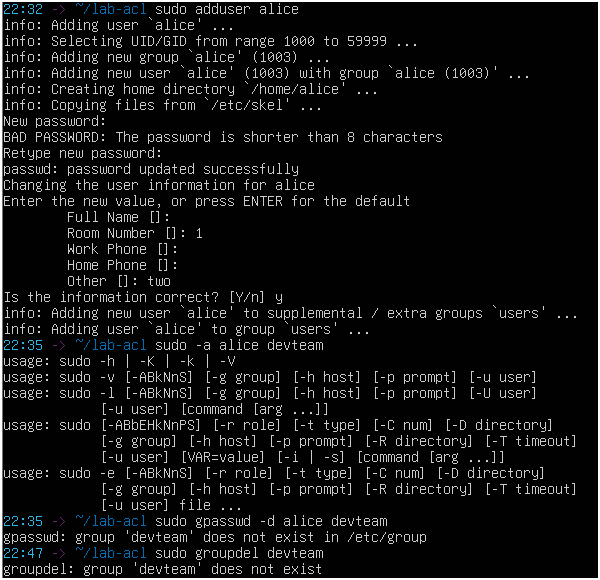

## praktikum 9.3B - group management

1. membuat group, menambahkan user ke group, dan memverifikasi keanggotaan.
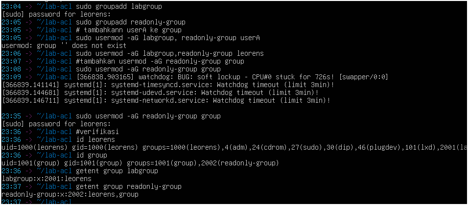

## praktikum 9.4 - konfigurasi sudo

1. Buat file konfigurasi sudo khusus untuk userA.
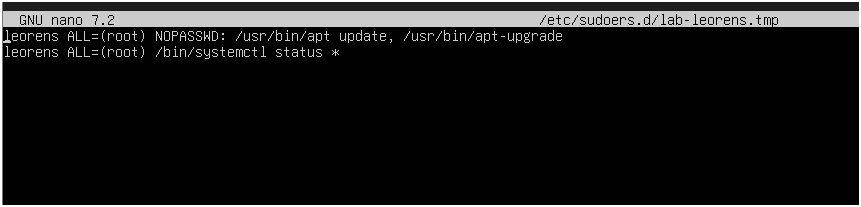

2.  Verifikasi aturan yang aktif dan uji hasilnya.
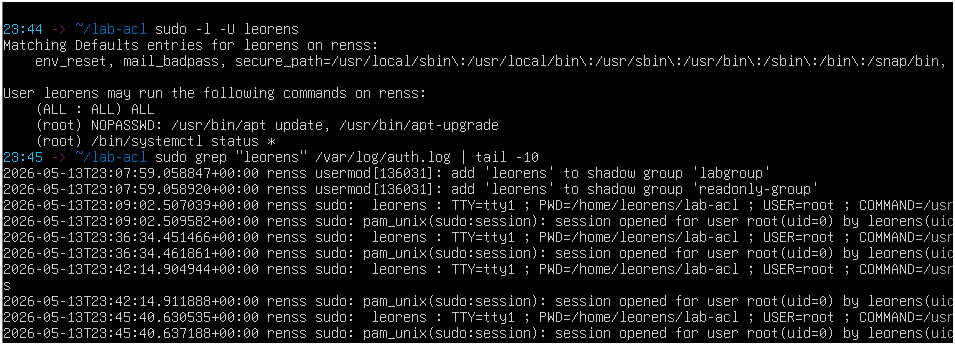

## praktikum 9.5 - disk quota

