# laporan praktikum sistem operasi

Nama : Mohamad Ahmad Gofar

NIM : 254107020068

# pendahuluan
## Latar belakang

berikut cara mengecheck fitur-fitur yang ada di dalam ubuntu 

## tujuan pratikum
1. agar lebih mengenal fitur-fitur di linux

### Praktikum 2.1-identifikasi CPU dan MEMORI

1. tampilkan informasi CPU 
 

2. tampilkan ringkasan memori 
 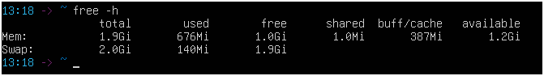

3. cek informasi hardware DMI/BIOS 
 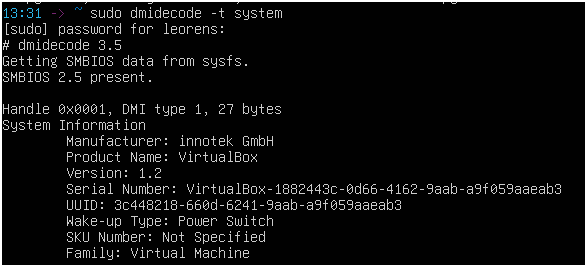

1. informasi CPU
 CPU(s) : 1
 Thread per second : 1
 core per second: 1

2. total RAM 
 RAM : 1.9 Gi
 
3. total swap 
 swap : 2.0 Gi

### Praktikum 2.2-identifikasi perangkat PCI/USB dan driver

 1. lihat daftar PCI 
  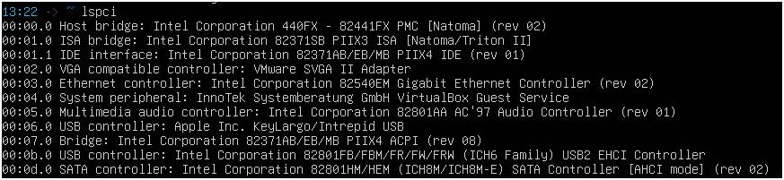

 2. lihat perangkat PCI beserta driver kenel yang di gunakan
  

 3. fokus pada NIC (ethernet) untuk mencari modul driver 
  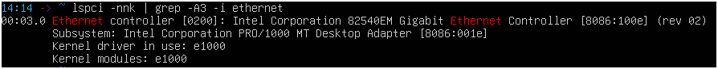

 4. lihat perangkat USB 
  

 5. lihat topologi USB (tree)
  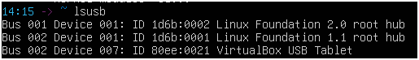 

 1. Ethernal controller [0200] : intelcorporation 82540em Gigabit ethernet controller [8086:100e] (rev02) 
 subsytem : VMware SVGA II Adapter [15ad:0177]
 kernel drive in use : e1000
 kernel modules : e1000 
 2. fungsi : Perangkat ini merupakan Network Interface Card (NIC) atau kartu jaringan berbasis Intel yang berfungsi sebagai pengontrol komunikasi data (Ethernet), sehingga sistem dapat terhubung ke jaringan lokal maupun internet. 
 
### Praktikum 2.3-identifikasi storage dan filesytem
 1. lihat daftar disk/partisi 
  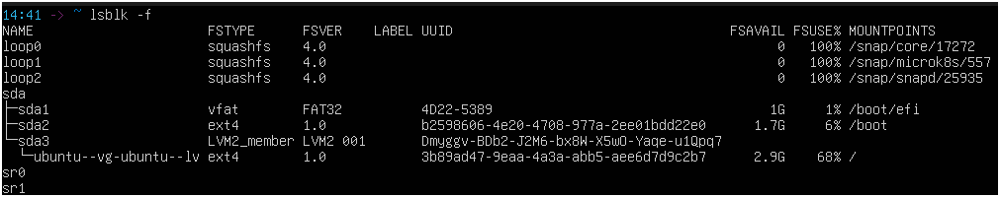

 2. Tampilkan UUID dan tipe filesystem 
  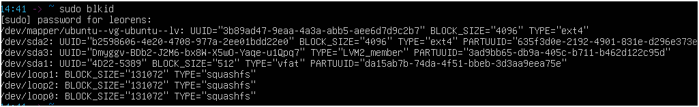

 3. Lihat mount point  untuk root filesystem 
  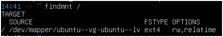

### Praktikum 2.4-melihat modul aktif dan informasinya
 1. cek versi kernel
  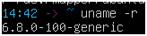

 2. Tampilkan daftar modul aktif 
  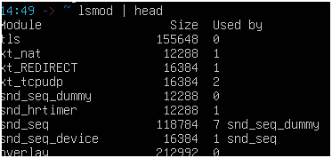

 3. Pilih salah satu modul dan lihat detailnya
  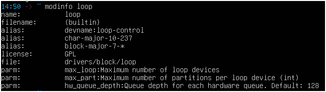

 4. muat modul lalu verifikasi 
  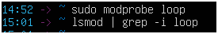

 5. lihat pesan kernel terbaru
  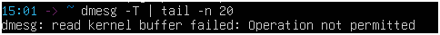

### Praktikum 2.5-konfigurasi auto-load dan blacklist
 1. buat file auto load 
  

 2. simulasikan verifikasi dengan memeastikan model sudah aktif
  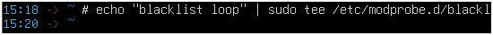

 3. blacklist modul
   

### Praktikum 2.6-mengenali block vs character device
 1. lihat detail salah satu disk
  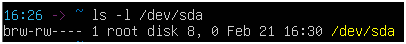
  
 2. lihat detail device terminal
  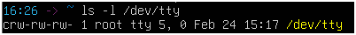

 3. lihat disk dan partisi untuk mengaitkan dengan /dev
  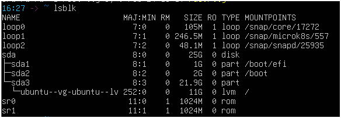

 1.  block device : terdapat pada (brw-rw---- 1 root disk 8, 0 feb21 16:30 /dev/sda)

 2. char divice :crw-rw-rw 1 root tty 5, 0 feb 24 15:17 /dev/tty

### Praktikum 2.7-melihat informasi udev
 1. cek atribut udev untuk disk
  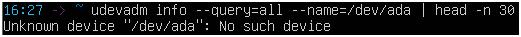

 2. monitor event udev 
  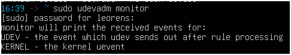

### Praktikum 2.8-membuat workspace praktikum 
 1. buat direktori praktikumdan masuk ke dalamnya 
  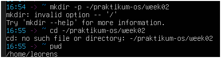

 2. buat beberapa file contoh 
  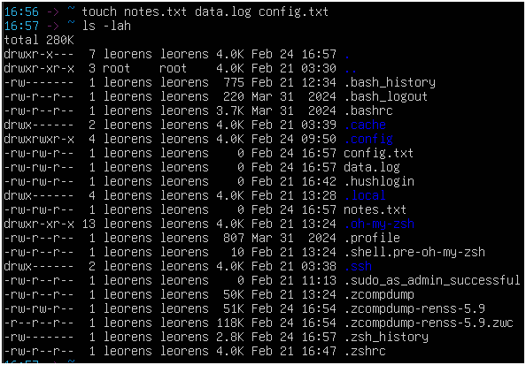

 3. isi file log contoh (simulasi)
  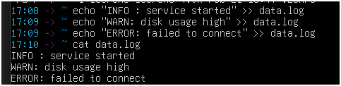

 4. baca file dengan less
  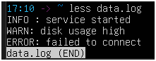

### Praktikum 2.9-pencarian poladengan grep
 1. cari baris yang mengandung ERROR pada data.log
  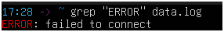

 2. cari tanpa memperhatikan huruf besar/kecil
  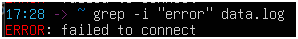 

 3. tampilkan nomor baris
  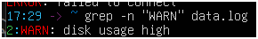

 4. tampilkan baris yang tidak cocok
  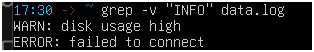

### Praktikum 2.10-substitusi dengan sed (Aman di file latihan)
 1. siapkan file konfigurasi latihan
  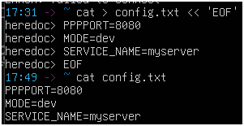

 2. ganti dev menjadi prod
  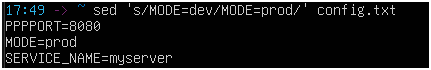 

 3. terapkan perubahan lansung ke file 
  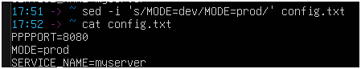

 4. ganti semua kemunculan kata 
  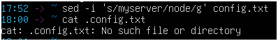

### Praktikum 2.11-Ekstraksi kolom dengan awk 
 1. lihat output df -h
  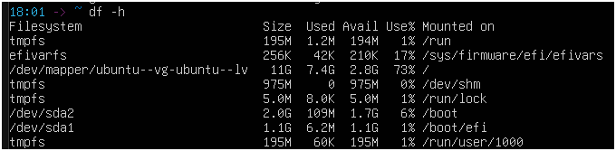
  
 2. ambil kolom filesystem dan presentase pemakaian
  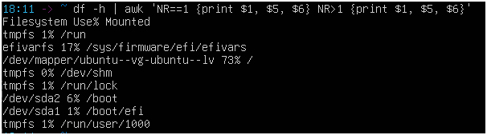

 3. filter hanya yang pemakai disk di atas 80%
  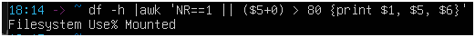

### Praktikum 2.12-melihat proses dengan ps
 1. Tampilkan semua proses 
  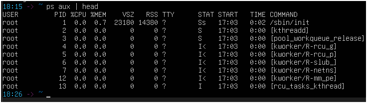

 2. cari proses tertentu
  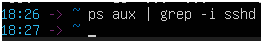

### Praktikum 2.13-monitoring real-time dengan top
 1. jalankan top 
  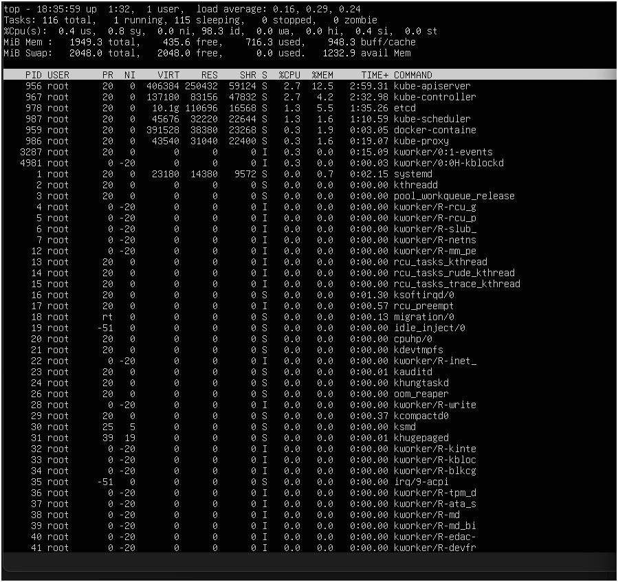

 2. amati nilai load average, pemakaian CPU, dan proses teratas tekan q untuk keluar 
  

### Praktikum 2.14-menhentikan proses dengan kill
 1. jalankan proses dummy di background
  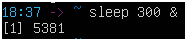

 2. cari PID proses sleep 
  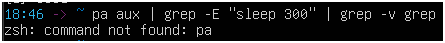

 3. hentikan dengan SIGTERM:
  
 
 4. verifikasi dengan berhenti
  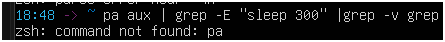

 5. jika proses sulit dihentikan dan anda membutuhkan untuk menghentikann proses tersebut gunakan SIGKILL:
  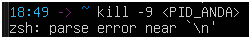

### Praktikum 2.15-cek disk, load dan service 
 1. cek penggunaan disk 
  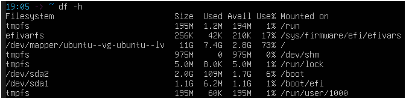

 2. cari direktori yang besar
  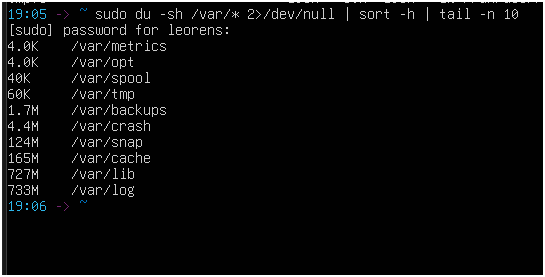

 3. cek load dan uptime
  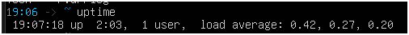

 4. cek service yang gagal
  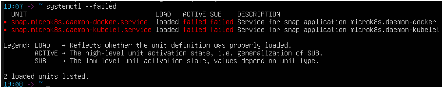

 5. ambil log error terbaru
  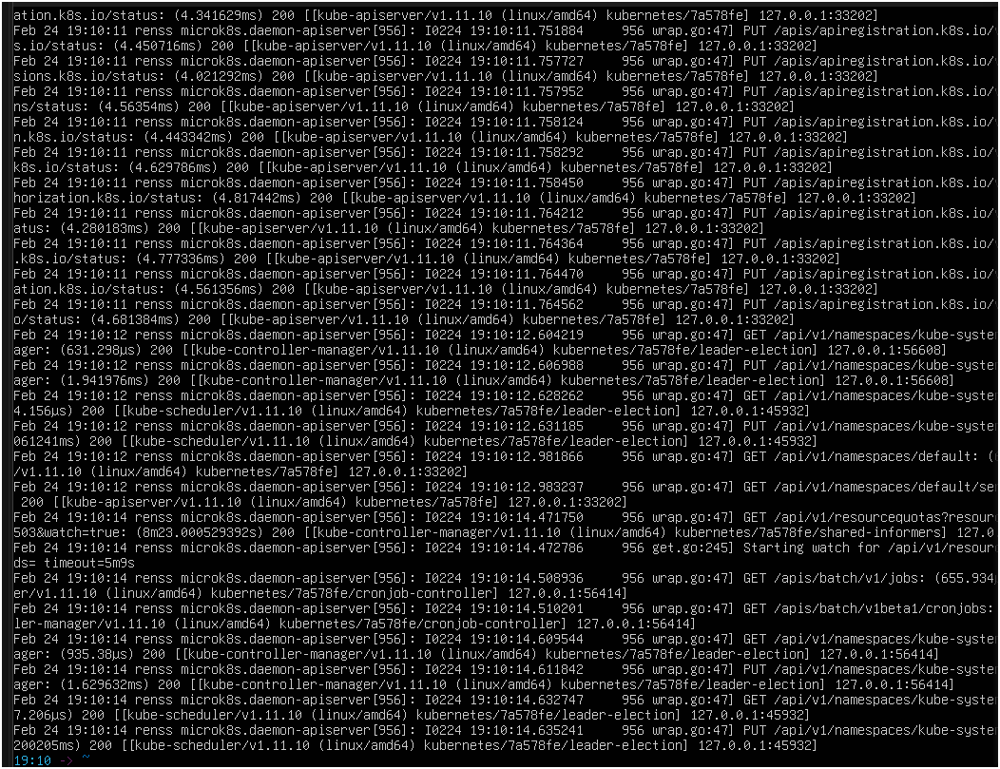

### Praktikum 2.16-monitoring port dan koneksi (network basics)
 1. lihat interface dan IP 
  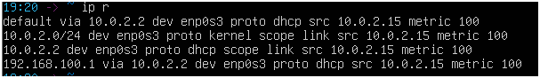

 2. lihat routing table
  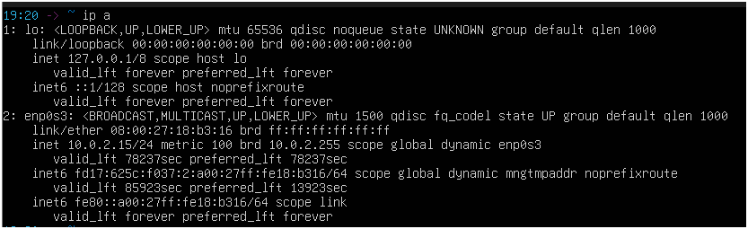

 3. lihat port yang sedang listening 
  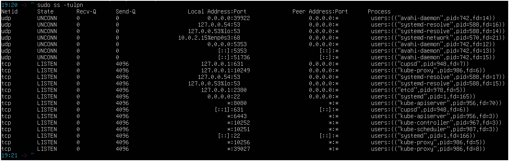

#### 1.9 latihan
 2.A multimedia audio controller [0401]: Intel Corporation 82801AA AC'97 Audio controller [8086:2415] (rev 01)

  Subsytem: Dell 82801AA AC'97 Audio Controller [1028:0177]

  kernel driver in use: snd_smbus

  kernel modules: = snd_intel8x0

 2.B filesystem : ext4
      
      UUID : b2598606-4e20-977a-2ee01bdd22e0

 2.C 

 2.D

