# laporan praktikum sistem operasi 

Nama : Mohamad Ahmad Gofar 

NIM : 254107020068

## Praktikum 6.1 melihat proses dan thread

1. tampilkan semua prosees yang berjalan
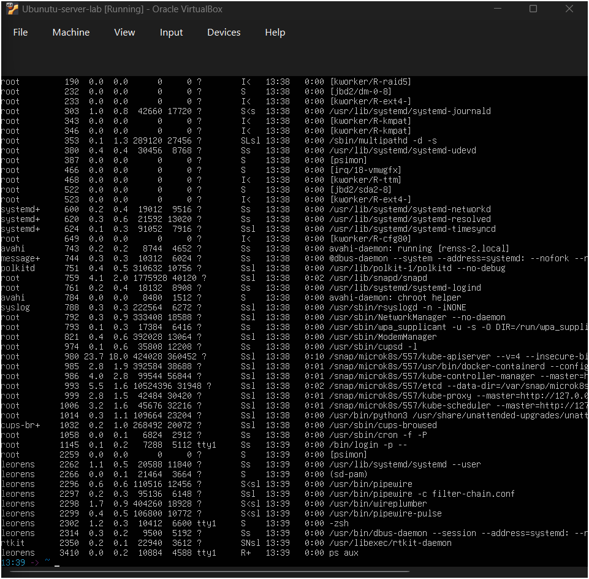

2. tampilkan proses beserta threadnya, dapat dilihat pada kolom LWP (Light Wwight Process ID)
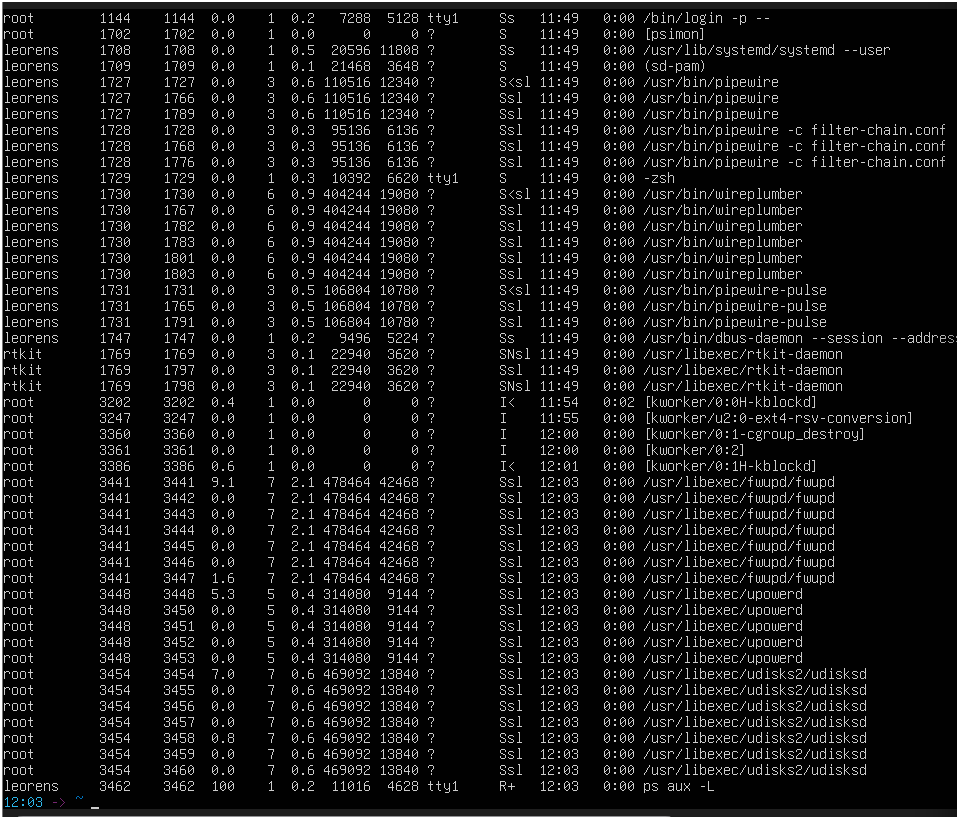

3. lihat PID shell aktif dan detail prosesnya 
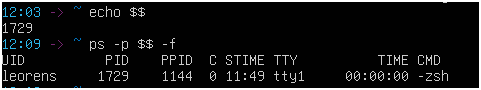

4. lihat hierarki proses secara visual
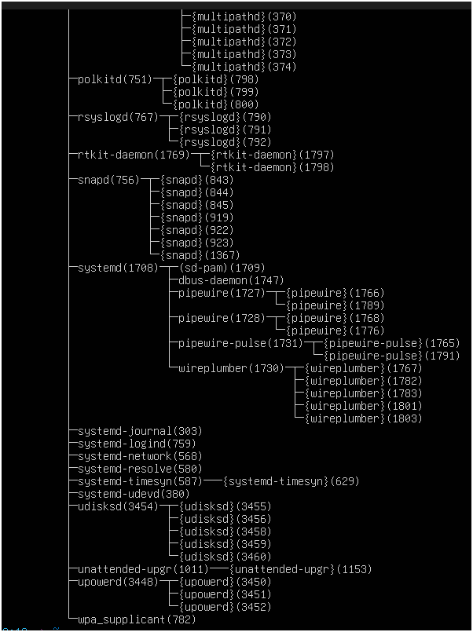

### Latihan 6.1
jalankan ps aux dan amati outputnya: 

 1. berapa total proses yang berjalan? proses apa yang memiliki PID 
 terkecil? 
 
 jawaban : terdapat 49 proses terdapat di proses root pertama
 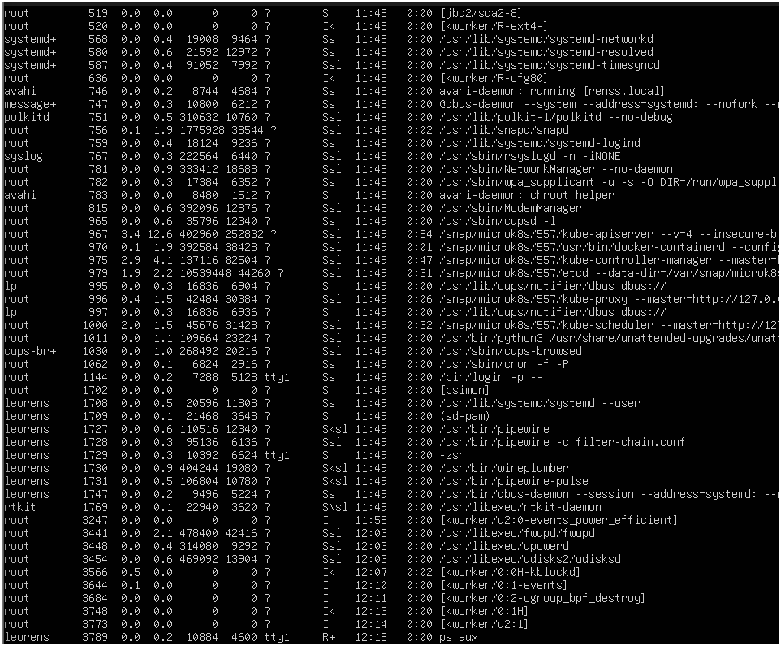

 2. jalankan pstree -p dan temukan proses bash anda. proses apa yang menjadi induk (PPID) dari bash tersebut?

 jawaban : proses login zsh(1436) induk bash tersebut adalah (1138)
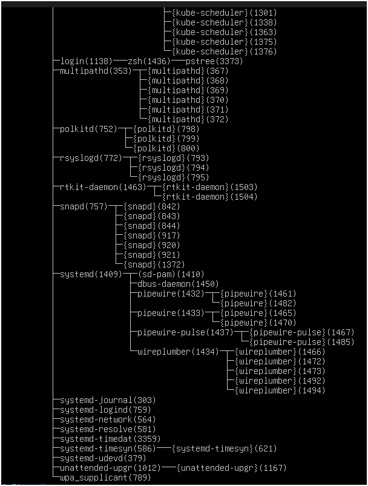

3. bandingkan output ps aux dan ps aux -L. apa perbedaan yang anda lihat?

jawaban : beda di bagian daftar proses yang ps aux -L di tambah thread di dalamnya, serta memiliki LWP dan NLWP untuk ps aux tidak memiliki hal tersebut, jumlah baris lebih banyak ps aux -L, kegunaan ps aux memberikan gambaran secara umum sedangkan untuk ps aux -L melihat detail bagaimana proses membagi tugas ke dalam thread

## Praktikum 6.2 - Mengamati siklus hidup proses

1. buat proses di backgroud dan amat kondisinya: 
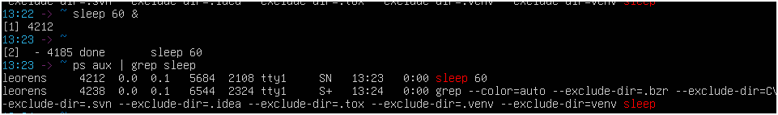

2. amati perubahan exit code dari perintah yang berhasil dan gagal

(berhasil)
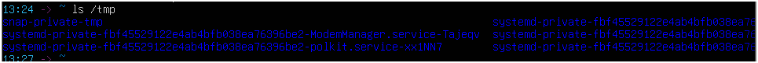

(gagal)
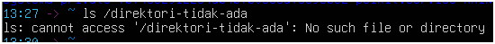

### latihan 6.2 

1. jalankan sleep 120 & dan mamati kolom STAT pada ps aux. kondisi apa yang di tampilkan? mengapa proses sleep berada di kondisi tersebut? 

jawaban : SN dan R+, muncul dikarenakan sesuai dengan apa yang sedang di lakukan 

2.  jalankan mengapa perintah yang berhasil dan yang gagal lalu catat exit code masing-masing. pola apa yang kamu temukan?

jawaban : berhasil output nomer 0, gagal output nomer 2

## Praktikum 6.3 - mengatur prioritas proses

1. jalankan proses dengan prioritas rendah 
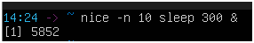

2. verifikasi nilai nice pada kolom NI
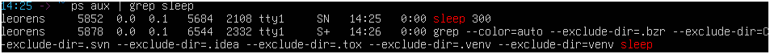

3. ubah nilai nice proses yang sudah berjalan 
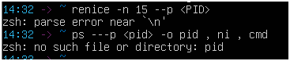

4. bersihkan proses percobaan 

### latihan 6.3

1. jalankan nice -n 5 sleep 200 & dabn verifikasi nnilai NI nya dengan ps
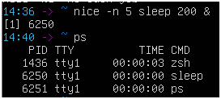

2. ubah nilai nice menjadi 10 menggunakan renice , lalu verifikasi kembali
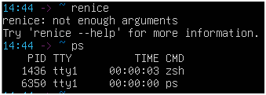

3. coba ubah nilai nice menjadi -5 tanpa sudo. apa yang terjadi? mengapa linux membatasi hal ini untuk user biasa?
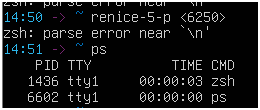

## Praktikum 6.4 - mengirim sinyal ke proses

1. buat proses percobaan 
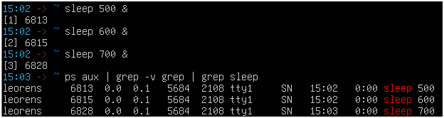

2. hentikan satu proses dengan SIGTERM dan verifikasi 
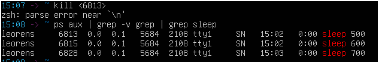

3. jeda dan lanjutlan proses dengan SIGSTOP/SIGCONT
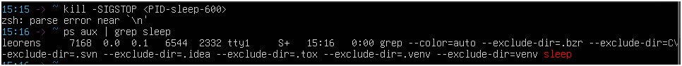
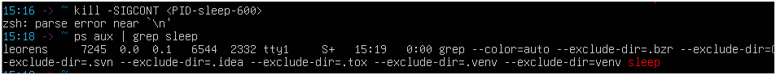

4. hentikan semua proses sleep sekaligus
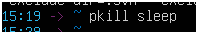

### latihan 6.4 

1. jalankan sleep 400 &,kirim SIGSTOP,dan amati perubahan kolom STAT. kondisi apa yang muncul

jawaban : 5684 2104 tty1

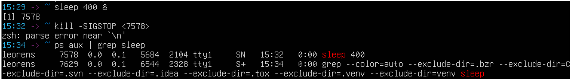

2. kirim SIGCONT dan verifikasi proses kembali berjalan 

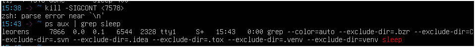

3. hentikan proses dengan SIGTERM laluverifikasi sudah tidak ada. kapan anda memilih SIGKILL daripada SIGTERM? 

jawaban : gunakan sigkill hanya ketika sigterm sudah gagal untuk menghentikan proses

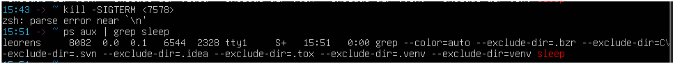

## praktikum 6.5 - manajemen job foregroud dan bacgroud

1. jalankan tiga job di baground 
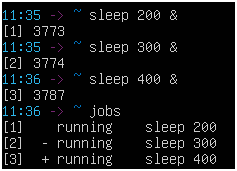

2. bawakan job pertama ke foreground, jeda, lalu kembalikan ke bacgroud
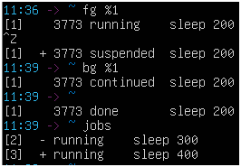

3. hentikan semua job 
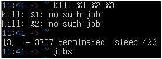

### latihan 6.5

1. jalankan top di foreground. apa yang terjadi di terminal

jawaban: akan menampilkan status dari ubuntu
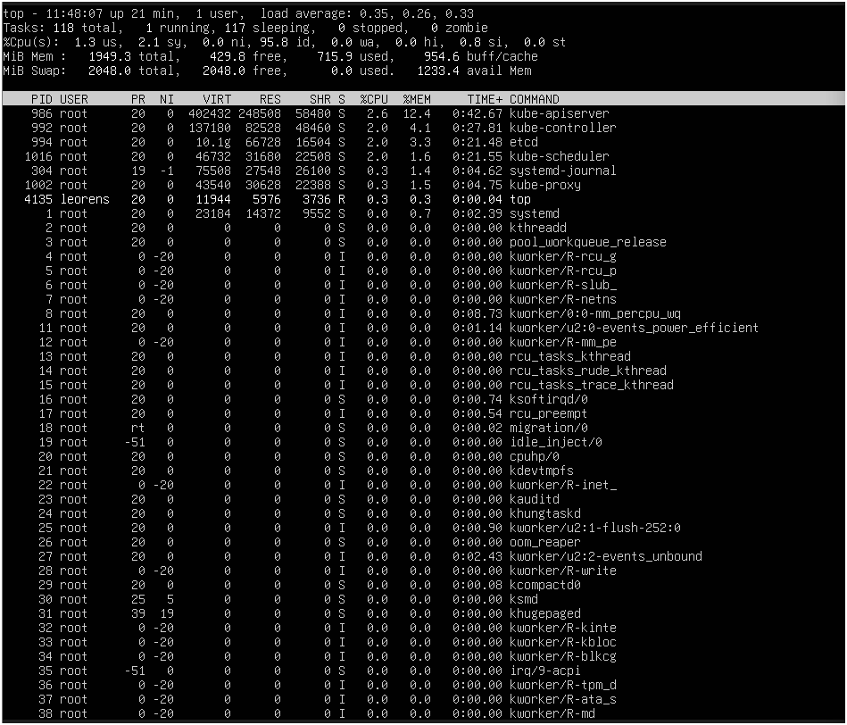

2. tekan CTRL+Z dan cek statusnya dengan jobs. kondisi apa yang di tampilkan? 

jawaban : kodisi berhenti (dijeda) tapi prosesnya tidak mati tapi tidak menggunakan cpu
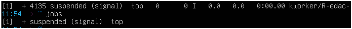

3. pindahkan ke bacground dengan bg. apakaah top dapat berjalan dengan baik di bacground? mengapa?

jawaban : tidak bisa walaupun terdapat status countinued  dan di pindahkan ke bg tpi program  top tidak akan menampilkan apa-apa dan tidak memperbarui data
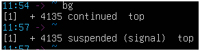

4. kembalikan ke foreground dengan fg, lalu keluar dengan q.
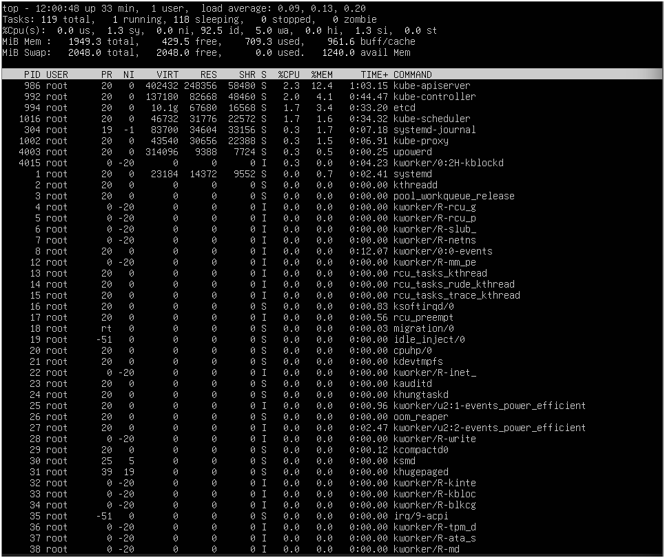

## Praktikum 6.6 -pemantauan proses

1. temukan proses dengan penggunaan CPU dan memori tertinggi 
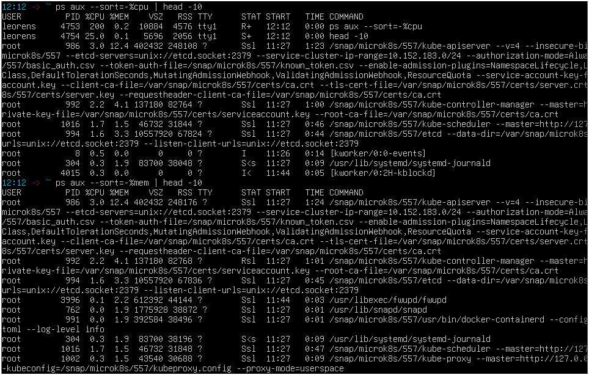

2. jalankan top dan eksplorasi shortcutnya 
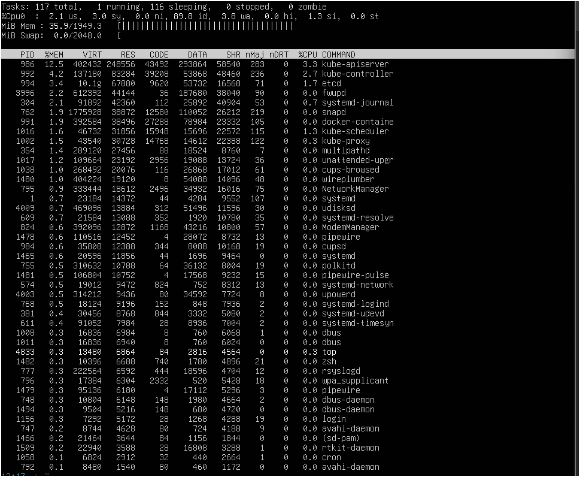

3. instal dan jalankan htop

### latihan 6.6

1. gunakan ps aux -sort=%men untuk menemukan proses yang menunggunakan memori paling banyak di vm anda. proses apa itu?

jawaban : proses root, PID 986, MEM 12.4 

2. di dalam toop tekan 1. apa yang berubah pada tampilan? mengapa informasi ini berguna?

jawaban : dari %cpu(s) menjadi %cpu0, karena untuk mengetahui penggunaan cpu
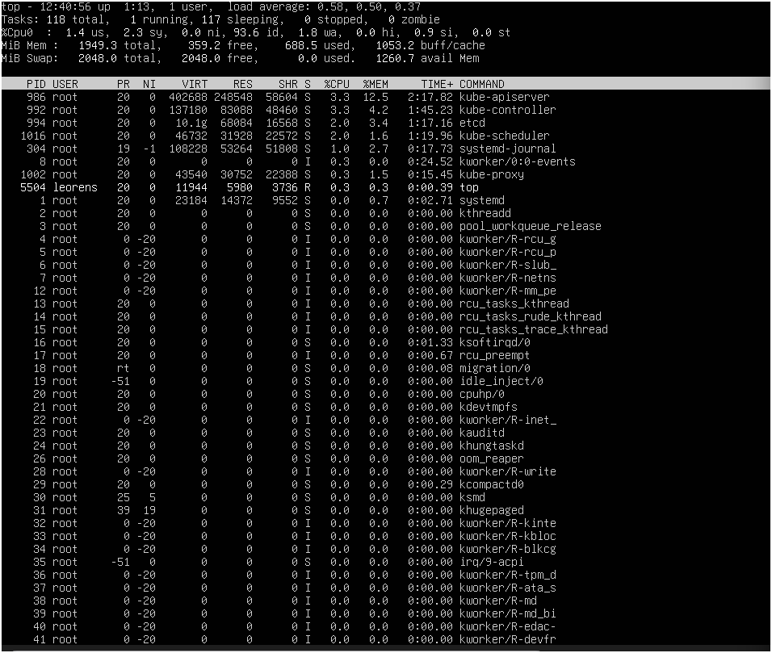

3. di dalam htop, navigasikan ke prosess sshd menggunakan tombol panah tekan F9 dan amati opsi sinyal yang tersedia.
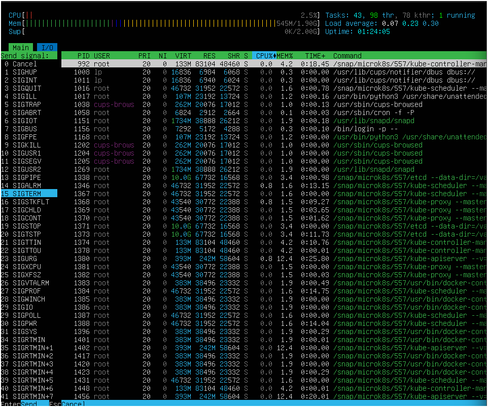

## 1.8 latihan 

### latihan 6.A
Eksplorasi proses sistem

1. jalankan ps aux -forest dan temukan proses dengan PID 1. apa nama dan fungsi proses tersebut dalam linux modern?

jawaban : uuntuk mengatur izin dalam penggunaannya

2. hitung berapa proses yang dimiliki oleh user saat root dan berapa yang dimiliki oleh user anda. ,mengapa root memiliki lebih banyak proses?
 jawaban : root 28, leorens 9, karena user root memiliki hak akses tertinggi maka dari itu memiliki banyak proses

3. temukan semua proses yang berada dalam kondisi S. mengapa sebagaian besar proses di sistem berada dalam kondisi ini? 

jawaban : karena mereka sedang menunggu sesuatu dan tidak sedang menggunakan cpu

### latihan 6.B
Simulasi manajemen job

1. jalankan tiga perintah verifikasi sleep dengan durasi 100,200,dan 300 detik di bacgroud. verifikasi ketiga dengan jobs.
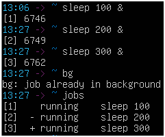

2. bawa job kedua ke foreground, jeda dengan CTRL+Z, lalu kemnalikan ke bacground dengan bg.
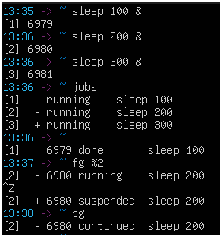

3. hentikan job pertama dengan kill %1. tampilkan kembali daftar job berapa job yang tersisa?

jawaban : tidak muncull karena jobs sudah selesai jadi tidak bisa 
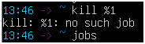

### latihan 6.C

1. jalankan dua proses sleep: satu dengan nice +5 dan satu dengan nice +15. verifikasi nilai NI keduanya dengan ps
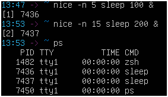

2. gunakan renice untuk mengubah nice proses oertama menjadi +10 proses mana yang kini lebuh diprioritaskan scheduler? 

3. kirim SIGSTOP ke salah satu proses, verifikasi kondisi T-nya, lalu kirim SIGSCONT. akhiri semua proses percobaan dengan pkill sleep.
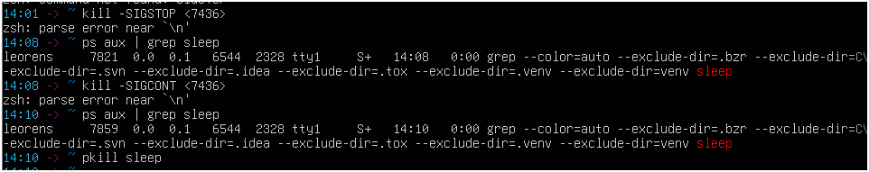

