# laporan praktikum sistem operasi

Nama : Mohamad Ahmad Gofar

NIM : 254107020068

## Tujuan prkatikum 

    pengenalan Bash sebagai Defauot di linux di karenakan bash adalah shell yang sangat umum di jumpai pada sistem linux modern

## Praktikum 6.1 - mengenal Bash dan menyiapkan workspace

1. lihat shell login dan shell aktif ini : 
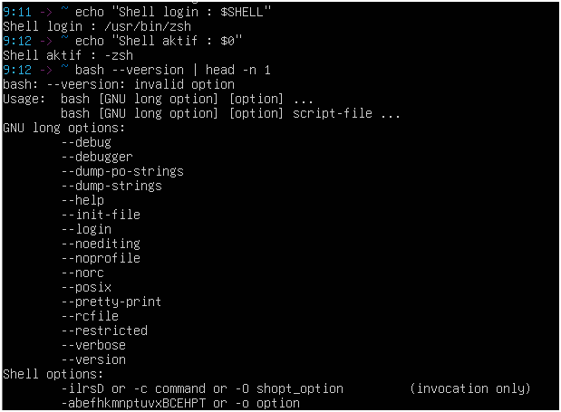

2. lihat proses shekk yang sedang berjalan :
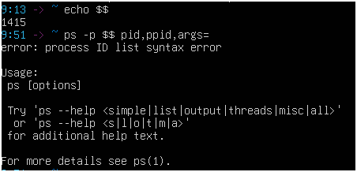

3. buat workspace praktikum : 
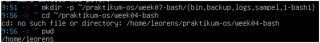

4. buat beberapa file contoh yang akan di pakai pada praktikum berikutnya 
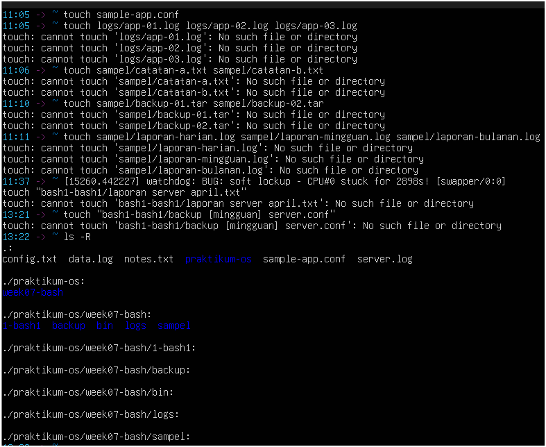

## Praktikum 6.2 - membuat ringkasan sesi terminal

1. masuk ke workspace praktikum 
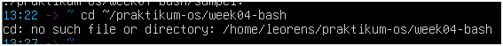

2. simpan informasi sesi terminal ke file laporan:
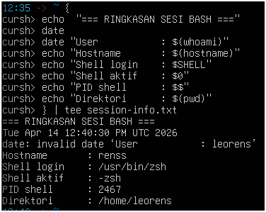

3. verifikasi isi file laporan:
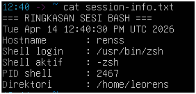

## Praktikum 6.3 - Menambahkan kofigurasi aman pada .bashrc

1. lihat file konfigurasi Bash pada home directory:

2. buat backup .bashrc:

3. tambahkan blok kofigurasi praktikum:
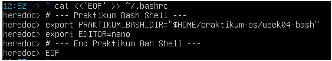

## Praktikum 6.4 - Menyiapkan .bash_profile untuk shell login

1. backup .bash_profile jika sudah ada:

2. tambahkan konfigurasi login shell:
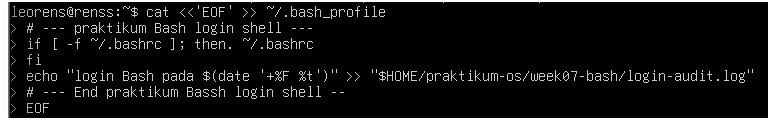

3. uji dengan membuka login sheel baru:
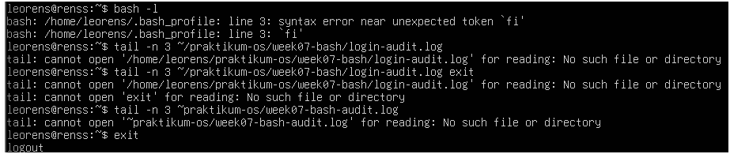

## Praktikum 6.5 - Membedakan variabel shell dan environtment variabel

1. buat variabel lokal:

2. buka subshell dan cek apakah variabel asih ada:
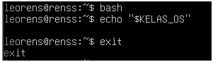

3. sekarang ubah menjadi environment variabel:
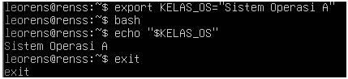

4. lihat isi pastch dan lokasi beberapa perintah:
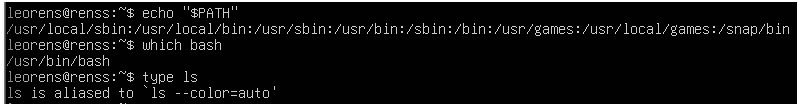

## Praktikum 6.6 - Menambahkan direktori script pribadi ke path

tujuan : membuat perintah administrasi sederhana yang bisa di panggil dari mana saja. 

1. pastikan direktori bin praktikum tersedia
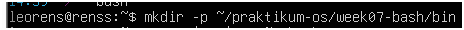

2. tambahkan direktori tersebut ke PATH melalui .bashrc:
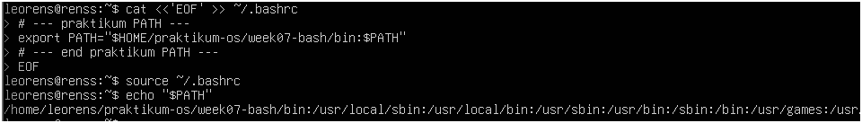

3. buat scriptringkasan sistem:
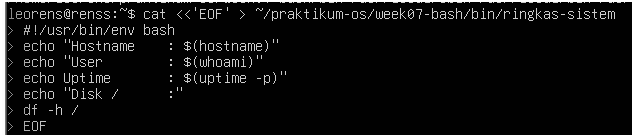

4. jalankan script dari direktori yang berbeda:
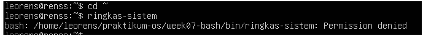

## praktikum 6.7 - Membuat alias produktivitas dasar

1. tambahkan alias ke .bashrc:
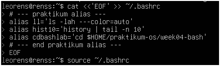

2. uji alias:
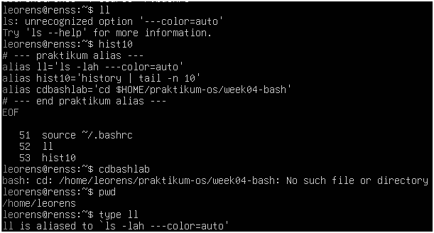

## praktikum 6.8 - membuat fungsi backup konfigurasi

1. siapkan file konfigurasi contoh: 
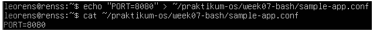

2. tambahkan fungsi ke .bashrc

3. uji fungsi: 
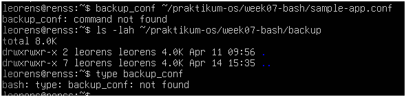

## Praktikum 6.9 - Menggunakan completion dasar dan melihat history

1. 
