# laporan praktikum

Nama : Mohamad Ahmad Gofar
NIM : 25410702068

## tujuan praktikum
 memperkenalkan bab dasar-dasar pemrograman bash : membuat script, mengelola variabel, menunis struktur kontrol, mendefinisikan fungsi, dan melakukan debungging

##  1.1 dasar-dasar scripting bash

## praktikum 7.1 script petama : laporan sistem
1. buat workspace praktikum:
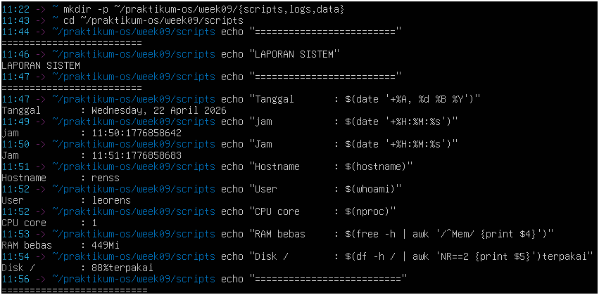

2. buat script dengan nano:
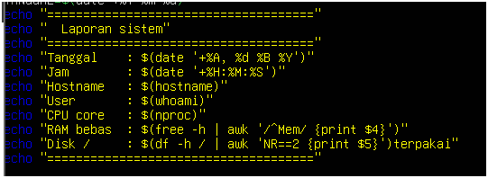
4. 
s
### latihan9.1
1. Modifikasi laporan-sistem.sh agar menyimpan output ke file
laporan-YYYY-MM-DD.txt sekaligus menampilkannya di terminal. Petunjuk:
gunakan tee yang sudah dipelajari di bab sebelumnya.
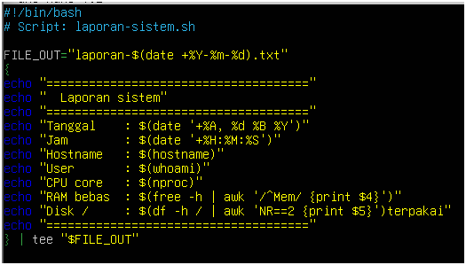

## praktikum 7.2 Script info sistem dengan argumen

1. buat script
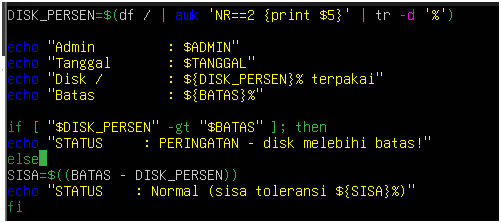

2. ketik isi berikut : 

3. simpan beri izin uji dengan berbagai kombinasi argumen:
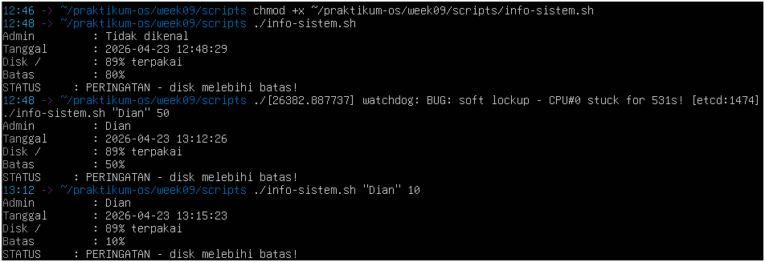

## praktikum 7.3 script grading dan menu iteraktif 
1. buat script grading (menggunakan if dan for):

2. ketik isi berikut
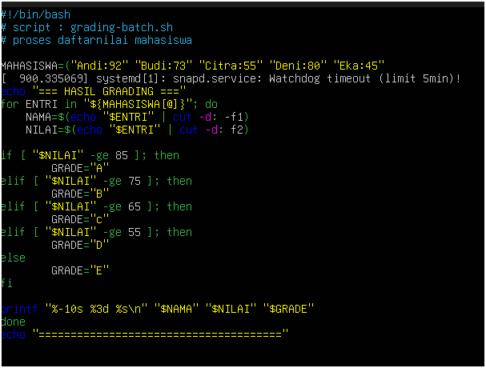

3. simpan, beri izin dan jalankan

4. buat script menu interaktif(while + case)

5. ketik isi berikut 

6. beri izin jalankan, coba setiap opsi
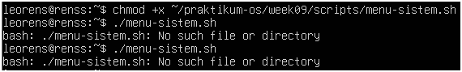 

### latihan 9.3
Tambahkan ke script grading-batch.sh sebuah ringkasan di bagian bawah
yang menampilkan: jumlah mahasiswa per grade (A, B, C, D, E) menggunakan
perulangan for kedua yang mengiterasi array MAHASISWA.
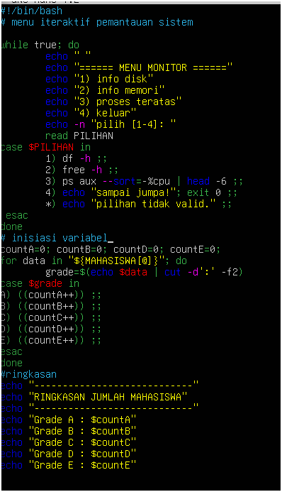

## praktikum 7.4 script library fungsi validasi

1. 

2. 

3. 

4. ketik isi berikut
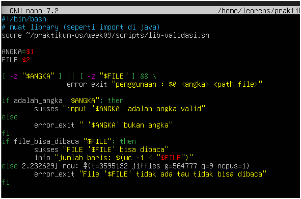

5. berikan izin dan uji semua skenario
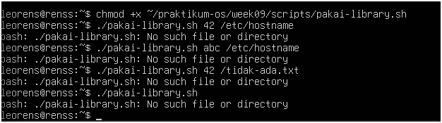

### latihan 9.4
Tambahkan fungsi konfirmasi() ke lib-validasi.sh.
Fungsi ini
menampilkan pertanyaan, membaca input Y/N dari user, mengembalikan
0 jika Y dan 1 jika N. Buat script demo yang memanggil fungsi ini sebelum
menghapus sebuah file
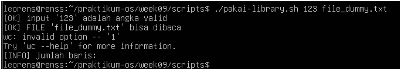

